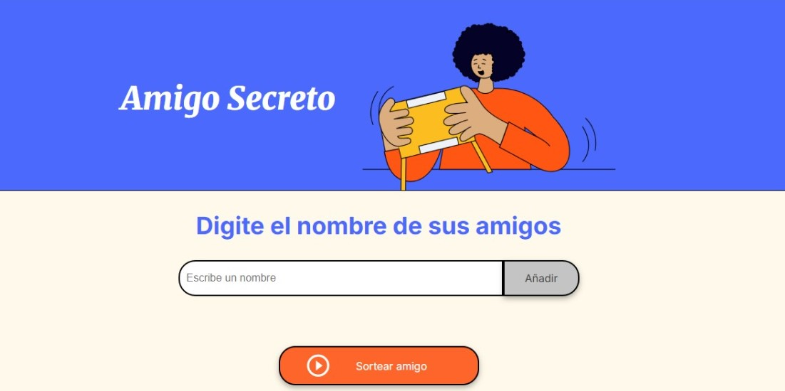

# Desafío amigo secreto

# Descripción del Proyecto 
Este proyecto es una aplicasión web creada de manera secilla y dinámica para sortear amigos secretos.
Se creo con el objetivo de poner el práctica los conocimientos adquiridos en Lógica de Programación.

# Características del Proyecto
Esta aplicación permite: 

Ingresar los nombres de tus amigos. 

Crear una lista con todos los nombres y mostrarla en pantalla.

Asignar al azar un amigo secreto.

# Instrucciones de uso
Escribe el nombre de tu amigo.

Da click en el botón "Añadir".

Repite con cada uno de tus amigos.

Posteriormente da click en "Sortear Amigo".

# Tecnologías utilizadas
JavaScript

HTML

CSS

# Creditos
Este proyecto fue desarrollado con Alura Latam, quienes proporcionaron las bases.
